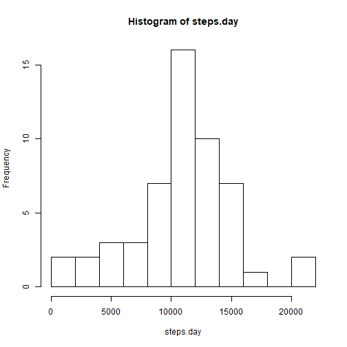
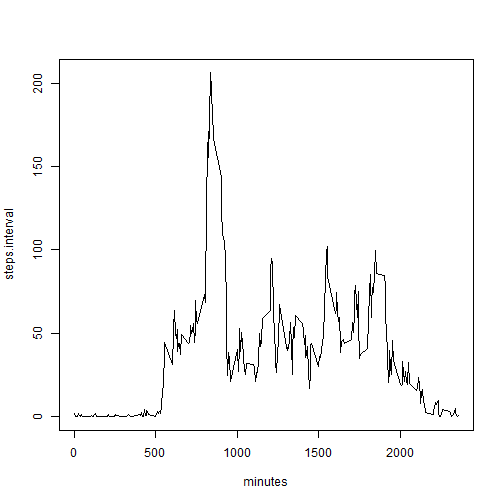
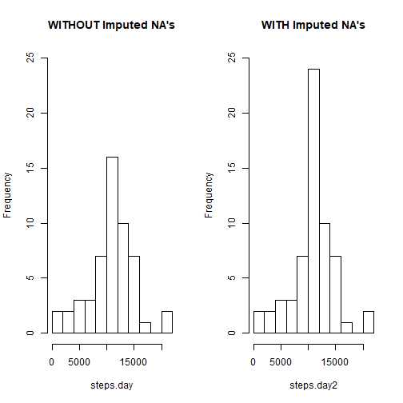
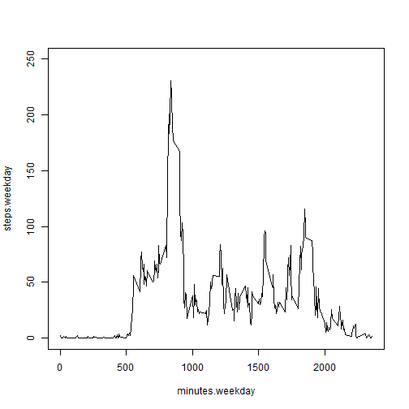
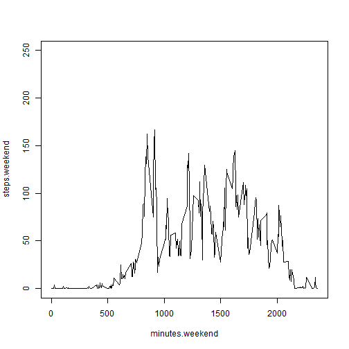

# Reproducible Research - Project 1

## 1. Loading and preprocessing the data


```r
setwd("C:/Users/Henry/Documents/DataScience/coursera/c05/p01")
rm(list=ls())
data <- read.csv("data/activity.csv")
data$date = as.Date(as.character(data$date), "%Y-%m-%d")
head(data)
```

```
##   steps       date interval
## 1    NA 2012-10-01        0
## 2    NA 2012-10-01        5
## 3    NA 2012-10-01       10
## 4    NA 2012-10-01       15
## 5    NA 2012-10-01       20
## 6    NA 2012-10-01       25
```

```r
str(data)
```

```
## 'data.frame':	17568 obs. of  3 variables:
##  $ steps   : int  NA NA NA NA NA NA NA NA NA NA ...
##  $ date    : Date, format: "2012-10-01" "2012-10-01" ...
##  $ interval: int  0 5 10 15 20 25 30 35 40 45 ...
```

## 2. mean total number of steps taken per day


```r
#Total number of steps per day
steps.day = tapply(data$steps,data$date, FUN=sum)
steps.day
```

```
## 2012-10-01 2012-10-02 2012-10-03 2012-10-04 2012-10-05 2012-10-06 
##         NA        126      11352      12116      13294      15420 
## 2012-10-07 2012-10-08 2012-10-09 2012-10-10 2012-10-11 2012-10-12 
##      11015         NA      12811       9900      10304      17382 
## 2012-10-13 2012-10-14 2012-10-15 2012-10-16 2012-10-17 2012-10-18 
##      12426      15098      10139      15084      13452      10056 
## 2012-10-19 2012-10-20 2012-10-21 2012-10-22 2012-10-23 2012-10-24 
##      11829      10395       8821      13460       8918       8355 
## 2012-10-25 2012-10-26 2012-10-27 2012-10-28 2012-10-29 2012-10-30 
##       2492       6778      10119      11458       5018       9819 
## 2012-10-31 2012-11-01 2012-11-02 2012-11-03 2012-11-04 2012-11-05 
##      15414         NA      10600      10571         NA      10439 
## 2012-11-06 2012-11-07 2012-11-08 2012-11-09 2012-11-10 2012-11-11 
##       8334      12883       3219         NA         NA      12608 
## 2012-11-12 2012-11-13 2012-11-14 2012-11-15 2012-11-16 2012-11-17 
##      10765       7336         NA         41       5441      14339 
## 2012-11-18 2012-11-19 2012-11-20 2012-11-21 2012-11-22 2012-11-23 
##      15110       8841       4472      12787      20427      21194 
## 2012-11-24 2012-11-25 2012-11-26 2012-11-27 2012-11-28 2012-11-29 
##      14478      11834      11162      13646      10183       7047 
## 2012-11-30 
##         NA
```

```r
#Total number of steps over two month period
sum(steps.day, na.rm=TRUE)
```

```
## [1] 570608
```

```r
#Histogram of steps per day
hist(steps.day, breaks = 10)
```



```r
#Mean and Median of steps per day
summary(steps.day)
```

```
##    Min. 1st Qu.  Median    Mean 3rd Qu.    Max.    NA's 
##      41    8841   10765   10766   13294   21194       8
```

The total number of steps per day is 570608, the median is 10765 and The mean is 10766. 

Note that the median and mean are very close, which indicates this distribution behaves like a normal distribution.

## 3. Average daily activity pattern


```r
#Calculating Averge number of steps per 5-minute interval
dataClean = data[!is.na(data$steps),]
steps.interval = tapply(dataClean$steps, dataClean$interval, FUN=mean)
minutes = as.integer(names(steps.interval))
#Ploting averge number of steps per 5-minute interval
plot(minutes,steps.interval, type = "l")
```



```r
#Maximumun Number of steps
max(steps.interval)
```

```
## [1] 206.1698
```

```r
#Minute and index with maximun number of steps
which.max(steps.interval)
```

```
## 835 
## 104
```

The maximun number of steps is 206.1698 and it occurs at the minute 835.

## 4. Imputing missing values


```r
#Calculating summary of the original data to show total number of NA's
summary(data$steps)
```

```
##    Min. 1st Qu.  Median    Mean 3rd Qu.    Max.    NA's 
##    0.00    0.00    0.00   37.38   12.00  806.00    2304
```

```r
#Separate NA values and substiture with the mean for that 5-minute interval
dataNA=data[is.na(data$steps),]
aux = rep(steps.interval, times = 8)
dataNA$steps=aux
#Creating new data set with imputed NA's
data2=rbind(dataClean,dataNA)
#Calculating the total number of steps per day with imputed NA's
steps.day2 = tapply(data2$steps,data2$date, FUN=sum)
#Ploting histograms to compare data with and without imputed NA's
par(mfrow=c(1,2))
hist(steps.day, breaks = 10, main="WITHOUT Imputed NA's", ylim = c(0,25))
hist(steps.day2, breaks = 10, main="WITH Imputed NA's",ylim=c(0,25))
```



```r
#Summary of data WITHOUT imputed values
summary(steps.day)
```

```
##    Min. 1st Qu.  Median    Mean 3rd Qu.    Max.    NA's 
##      41    8841   10765   10766   13294   21194       8
```

```r
#Summary of data WITH imputed values
summary(steps.day2)
```

```
##    Min. 1st Qu.  Median    Mean 3rd Qu.    Max. 
##      41    9819   10766   10766   12811   21194
```

The strategy for filling the missing values of the dataset was the mean of the 5-Minute Interval. With this strategy, the mean and the median remained the same in both cases. The histogram preserves its shape but it has a higher frequency of observations around the mean.


## 5. Are there differences in activity patterns between weekdays and weekends?


```r
#Setting category for Weekdays and Weekends
data2$weekday = weekdays(data2$date)
data2$category = ifelse(data2$weekday %in% c("Saturday","Sunday"),"Weekend","Weekday")
#spliting the data according to category Weekday/Weekend
dataWeekday=data2[data2$category=="Weekday",]
dataWeekend = data2[data2$category=="Weekend",]
#Calculating Averge number of steps per 5-minute interval
steps.weekday = tapply(dataWeekday$steps, dataWeekday$interval, FUN=mean)
steps.weekend = tapply(dataWeekend$steps, dataWeekend$interval, FUN=mean)
minutes.weekday = as.integer(names(steps.weekday))
minutes.weekend = as.integer(names(steps.weekend))
#Ploting averge number of steps per 5-minute interval for weekday
plot(minutes.weekday,steps.weekday, type = "l", ylim = c(0,250))
```



```r
#Ploting averge number of steps per 5-minute interval for weekend
plot(minutes.weekend,steps.weekend, type = "l", ylim = c(0,250))
```



According to these plots, there is a clear difference in the steps pattern during weekdays and weekends. During Weekdays the activity is less with peaks sparsely distributed during the day. During weekends there is more constant activity throughout the day.
